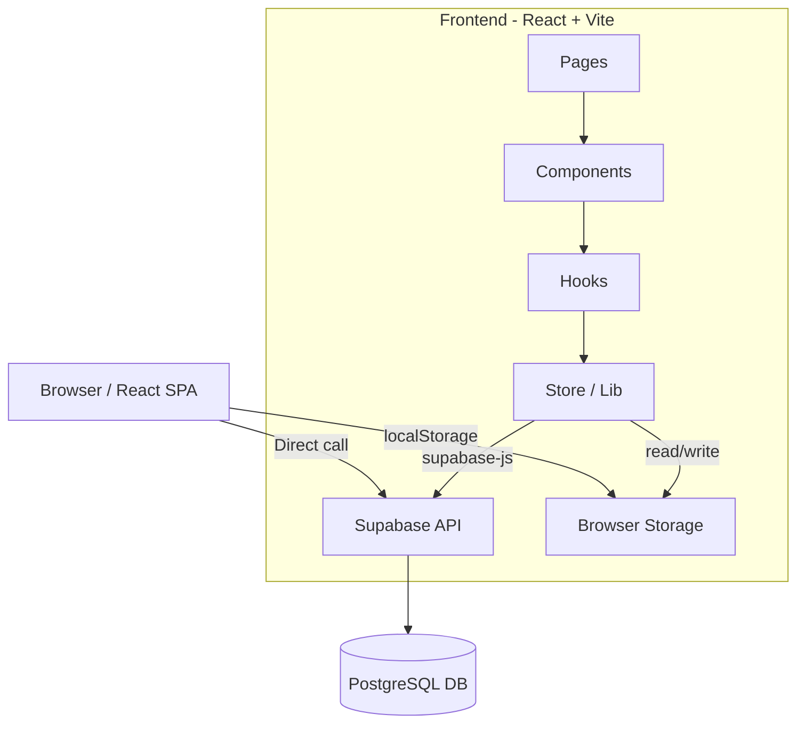

# 🔍 Audit Frontend — Habit Tracker

> **Tanggal Audit:** 26 April 2026  
> **Scope:** Seluruh kode di folder `frontend/src/`  
> **Tujuan:** Analisis alur proyek, saran migrasi backend (Node.js), dan review clean code

---

## 1. Gambaran Arsitektur Saat Ini



### Alur Utama

| Alur              | Deskripsi                                                                                              |
| ----------------- | ------------------------------------------------------------------------------------------------------ |
| **Login**         | User klik OAuth (Google/GitHub) → Supabase Auth langsung dari browser → redirect ke Dashboard          |
| **Dashboard**     | `AuthContext` cek session → jika ada, render `HabitTracker` → fetch habits & completions dari Supabase |
| **CRUD Habit**    | `useHabits` hook → `habitStore` / `completionStore` → langsung panggil Supabase dari frontend          |
| **User Settings** | Fetch/upsert `user_preferences` langsung ke Supabase → ganti bahasa (i18n) & font                      |
| **Reminder**      | Disimpan di `localStorage` → Browser Notification API (client-side only)                               |
| **Theme**         | Disimpan di `localStorage` → toggle class `dark` di `<html>`                                           |

---

## 2. Struktur File

```
src/
├── main.tsx                    # Entry point + i18n init
├── i18n.ts                     # Konfigurasi i18next
├── App.tsx                     # Router setup
├── App.css                     # ⚠️ TIDAK TERPAKAI (sisa template Vite)
├── index.css                   # Global styles + Tailwind + font classes
│
├── context/
│   └── AuthContext.tsx          # Auth state provider (Supabase session)
│
├── hooks/
│   ├── useHabits.ts             # CRUD habits + completions
│   ├── useReminder.ts           # Reminder settings (localStorage)
│   ├── useTheme.ts              # Dark/light toggle (localStorage)
│   └── use-mobile.tsx           # Media query hook (tidak terpakai)
│
├── lib/
│   ├── utils.ts                 # cn() helper (tailwind-merge)
│   ├── supabase/
│   │   └── supabaseClient.ts    # Supabase client init
│   └── habits/
│       ├── types.ts             # Habit, Completion, ReminderSettings
│       ├── store.ts             # Data layer (Supabase + localStorage)
│       └── utils.ts             # Pure functions (streak, completion rate)
│
├── pages/
│   ├── auth/Login.tsx           # Halaman login OAuth
│   ├── dashboard/Dashboard.tsx  # Protected route → HabitTracker
│   └── profile/UserSettings.tsx # Pengaturan bahasa & font
│
└── components/
    ├── auth/
    │   ├── GoogleButton.tsx      # Tombol OAuth Google
    │   └── GithubButton.tsx      # Tombol OAuth GitHub
    ├── habits/
    │   ├── HabitTracker.tsx      # Container utama dashboard
    │   ├── HabitHeader.tsx       # Header + dropdown profil
    │   ├── HabitList.tsx         # Tabel habit + dialog edit/delete
    │   ├── HabitStats.tsx        # Statistik bulan (3 kartu)
    │   ├── AddHabit.tsx          # Dialog tambah habit
    │   ├── ReminderControl.tsx   # Dialog pengingat
    │   ├── CompletionDonut.tsx   # SVG donut chart
    │   └── TrendChart.tsx        # Recharts area chart
    └── ui/                      # Shadcn/Base UI primitives (13 file)
```

---

## 3. Temuan Masalah & Saran Clean Code

### 3.1 🔴 Masalah Kritis

| #   | File              | Masalah                                                                                                                                      | Saran                                                |
| --- | ----------------- | -------------------------------------------------------------------------------------------------------------------------------------------- | ---------------------------------------------------- |
| 1   | `.env`            | **Supabase anon key ter-commit ke repo.** Meskipun anon key, sebaiknya gunakan `.env.example` sebagai template                               | Buat `.env.example` tanpa value                      |
| 2   | `store.ts` L27-61 | **Tidak ada error handling ke UI.** `habitStore.add()` dan `.delete()` hanya `throw error` tanpa ditangkap di UI. User tidak tahu jika gagal | Tambah try/catch di `useHabits` + toast notification |
| 3   | `App.tsx` L13-14  | **Route `/user-settings` tidak dilindungi.** Siapapun bisa akses tanpa login. Hanya `Dashboard` yang cek session internal                    | Buat `ProtectedRoute` wrapper component              |
| 4   | `store.ts` L38    | **`getUser()` dipanggil setiap add habit.** Ini network request tambahan yang tidak perlu karena user ada di `AuthContext`                   | Terima `userId` sebagai parameter                    |

### 3.2 🟡 Masalah Menengah

| #   | File                        | Masalah                                                                                               | Saran                                            |
| --- | --------------------------- | ----------------------------------------------------------------------------------------------------- | ------------------------------------------------ |
| 5   | `App.css`                   | **Seluruh file tidak terpakai** — sisa template Vite (`counter`, `hero`, `#center`)                   | **Hapus file ini**                               |
| 6   | `use-mobile.tsx`            | **Hook tidak digunakan** di manapun                                                                   | Hapus atau gunakan untuk responsiveness          |
| 7   | `index.css` L44-46          | **Kode CSS di-comment out** — dead code                                                               | Hapus baris yang di-comment                      |
| 8   | `index.css` L134            | **Import font Caveat** tapi yang dipakai `Delicious Handrawn`. Caveat tidak digunakan                 | Hapus import Caveat                              |
| 9   | `index.html` L7             | **`<title>frontend</title>`** — masih default template                                                | Ganti ke `Atomic Habits`                         |
| 10  | `UserSettings.tsx` L103-106 | **Upsert hanya kirim 1 field** — `{ user_id, [type]: value }`. Field lain bisa ter-null saat conflict | Kirim kedua field: `{ user_id, language, font }` |
| 11  | `Dashboard.tsx` L11         | **Hardcoded `"Please wait"`** — belum pakai `t()`                                                     | Tambah `useTranslation`                          |
| 12  | `GoogleButton.tsx` L33      | **Hardcoded `"Login with Google"`** — belum i18n                                                      | Tambah `useTranslation`                          |
| 13  | `GithubButton.tsx` L18      | **Hardcoded `"Login with GitHub"`** — belum i18n                                                      | Tambah `useTranslation`                          |

### 3.3 🟢 Saran Peningkatan

| #   | File                 | Saran                                                                                |
| --- | -------------------- | ------------------------------------------------------------------------------------ |
| 14  | `useReminder.ts` L39 | Notification body hardcoded Bahasa Indonesia. Gunakan `t()`                          |
| 15  | `HabitList.tsx`      | Terlalu besar (~250 baris). Pisahkan `DeleteDialog` dan `EditDialog` ke file sendiri |
| 16  | `HabitHeader.tsx`    | ~140 baris. Dropdown bisa diekstrak ke `ProfileDropdown.tsx`                         |
| 17  | `types.ts`           | Tidak ada type untuk `UserPreferences`                                               |
| 18  | `utils.ts` L121      | `export { parseISO }` — re-export tidak digunakan di manapun                         |
| 19  | Seluruh proyek       | Tidak ada **Error Boundary** — jika komponen crash, app blank putih                  |

---

## 4. Saran Migrasi ke Backend (Node.js)

### 4.1 Mengapa Perlu Backend?

Saat ini frontend **langsung ke Supabase**. Artinya:

- ❌ Business logic di frontend — bisa dimanipulasi via DevTools
- ❌ Tidak bisa tambah fitur server-side (email, cron, webhook)
- ❌ Sulit integrasi pihak ketiga (payment, push notification)
- ❌ Tidak ada rate limiting / input validation server-side

### 4.2 Apa yang Harus Dipindah?

#### Layer 1 — Wajib Dipindah (Keamanan)

| Komponen                  | Lokasi                  | Endpoint Backend               |
| ------------------------- | ----------------------- | ------------------------------ |
| `habitStore.list()`       | `store.ts` L28-35       | `GET /api/habits`              |
| `habitStore.add()`        | `store.ts` L37-46       | `POST /api/habits`             |
| `habitStore.update()`     | `store.ts` L48-55       | `PATCH /api/habits/:id`        |
| `habitStore.delete()`     | `store.ts` L57-61       | `DELETE /api/habits/:id`       |
| `completionStore.*`       | `store.ts` L64-97       | `POST/DELETE /api/completions` |
| `user_preferences` upsert | `UserSettings.tsx` L127 | `PATCH /api/user/preferences`  |

#### Layer 2 — Fitur Baru (Hanya Bisa di Backend)

| Fitur                 | Deskripsi                                                |
| --------------------- | -------------------------------------------------------- |
| **Email Reminder**    | Cron job kirim email harian (ganti browser notification) |
| **Streak Protection** | Logic server-side untuk freeze streak                    |
| **Analytics**         | Statistik mingguan/bulanan → email summary               |
| **Rate Limiting**     | Cegah spam request                                       |
| **Data Export**       | Download CSV/PDF data habit                              |
| **Webhook**           | Integrasi Telegram/Discord bot                           |

#### Layer 3 — Tetap di Frontend

| Komponen                             | Alasan                            |
| ------------------------------------ | --------------------------------- |
| `useTheme`                           | Preferensi visual, tidak sensitif |
| `useReminder` (browser notification) | Hanya relevan di browser          |
| `utils.ts` (streak, rate)            | Pure calculation untuk display    |
| Semua UI komponen                    | Rendering tetap di client         |
| i18n / terjemahan                    | JSON di-serve static              |

### 4.3 Struktur Backend yang Diusulkan

```
backend/
├── src/
│   ├── index.ts                    # Express/Fastify entry
│   ├── config/
│   │   ├── env.ts                  # Environment variables
│   │   └── supabase.ts             # Supabase Admin client (service_role key)
│   ├── middleware/
│   │   ├── auth.ts                 # Verify Supabase JWT dari header
│   │   ├── rateLimiter.ts          # Rate limiting
│   │   └── errorHandler.ts         # Global error handler
│   ├── routes/
│   │   ├── habits.ts               # CRUD habits
│   │   ├── completions.ts          # Toggle completions
│   │   ├── preferences.ts          # User preferences
│   │   └── stats.ts                # Analytics endpoints
│   ├── services/
│   │   ├── habitService.ts         # Business logic habits
│   │   ├── completionService.ts    # Business logic completions
│   │   ├── notificationService.ts  # Email/push notifications
│   │   └── statsService.ts         # Streak, rates (server-side)
│   ├── validators/
│   │   ├── habitValidator.ts       # Zod schema validasi input
│   │   └── preferenceValidator.ts
│   └── jobs/
│       └── dailyReminder.ts        # Cron job reminder
├── package.json
├── tsconfig.json
└── .env                            # SUPABASE_SERVICE_ROLE_KEY (rahasia!)
```

### 4.4 Alur Setelah Ada Backend

```
SEBELUM (sekarang):
  Browser → supabase-js → Supabase API → PostgreSQL

SESUDAH (rekomendasi):
  Browser → Node.js API → Supabase Admin SDK → PostgreSQL
           ↑
     Verify JWT token
     Validasi input (Zod)
     Business logic
     Rate limiting
```

---

## 5. Prioritas Perbaikan

### 🏁 Fase 1 — Quick Fix (sekarang)

- [ ] Hapus `App.css` — file tidak terpakai
- [ ] Hapus `use-mobile.tsx` — hook tidak terpakai
- [ ] Hapus dead code di `index.css` (comment & Caveat import)
- [ ] Ganti `<title>` di `index.html` ke `"Atomic Habits"`
- [ ] Tambah `useTranslation` ke `Dashboard.tsx`, `GoogleButton.tsx`, `GithubButton.tsx`
- [ ] Buat `.env.example`

### 🏗️ Fase 2 — Refactoring

- [ ] Buat `ProtectedRoute` component
- [ ] Fix upsert di UserSettings (kirim kedua field)
- [ ] Tambah error handling + toast di `useHabits`
- [ ] Pecah `HabitList.tsx` → pisahkan dialog ke file sendiri
- [ ] Tambah `ErrorBoundary` di `App.tsx`
- [ ] Tambah type `UserPreferences` di `types.ts`

### 🚀 Fase 3 — Backend Node.js

- [ ] Setup project (Express/Fastify + TypeScript)
- [ ] Migrasi `store.ts` ke API endpoints
- [ ] JWT verification middleware
- [ ] Input validation (Zod)
- [ ] Ganti `supabase-js` di frontend → `fetch`/`axios` ke backend
- [ ] Implementasi server-side reminder (cron + email)

---

## 6. Ringkasan

| Kategori                           | Jumlah                                            |
| ---------------------------------- | ------------------------------------------------- |
| 🔴 Masalah Kritis                  | 4                                                 |
| 🟡 Masalah Menengah                | 9                                                 |
| 🟢 Saran Peningkatan               | 6                                                 |
| File tidak terpakai                | 2 (`App.css`, `use-mobile.tsx`)                   |
| Komponen perlu dipindah ke backend | 6 (semua operasi `store.ts` + `user_preferences`) |
| File yang belum i18n               | 3 (`Dashboard`, `GoogleButton`, `GithubButton`)   |

> [!TIP]
> Untuk mulai backend, fokus **Layer 1** dulu — pindahkan CRUD dari `store.ts` ke REST API. Ini memberi fondasi kokoh sebelum menambah fitur baru.
